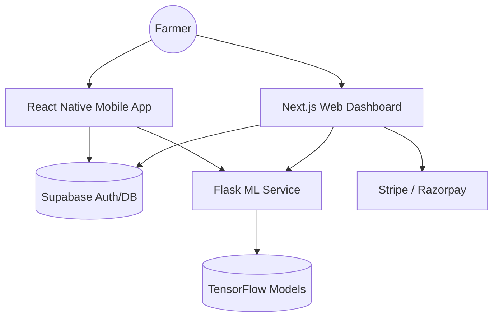

# Progeny AI: Professional Plant Disease Detection Platform

Progeny AI is an advanced, production-grade ecosystem designed to empower farmers with AI-powered plant pathology. This repository contains the complete source code for the Web Dashboard, the Machine Learning Inference Service, and the Mobile Application.

## 📦 Creating the Zip Package
To generate the final source code ZIP for submission or backup:
1. Open PowerShell in the project root.
2. Run: `.\zip-progeny.ps1`
3. The ZIP will be created in the root of the project with a timestamp.

> [!IMPORTANT]
> **Live Production Status:** This project is currently deployed and active.
> - **Web Dashboard:** [progeny-api.vercel.app](https://progeny-api.vercel.app)
> - **ML Service:** [darshandr4-progeny-backend.hf.space](https://darshandr4-progeny-backend.hf.space)
> - **Mobile Download:** Available via Expo/EAS distribution.

## 🏗️ Platform Architecture

The platform consists of three main components working in sync:



## 📂 Project Structure

- **`/progeny-main`**: Next.js 14 frontend dashboard with user management and scan history.
- **`/backend`**: Python Flask service handling image inference using TensorFlow and Groq AI for remedies.
- **`/progeny-mobile`**: Expo-based mobile application for on-the-field disease detection.
- **`/scripts`**: Utility scripts for deployment and maintenance.

## 🚀 Quick Start (Local Development)

### 1. Prerequisites
- Node.js 18+ & npm/pnpm
- Python 3.9+
- Git

### 2. Full Installation
To set up the entire platform locally, follow these steps:

#### Web Dashboard
```bash
cd progeny-main
npm install
cp .env.example .env.local
# Add your Supabase & ML Service credentials
npm run dev
```

#### ML Backend
```bash
cd backend
python -m venv venv
source venv/bin/activate  # venv\Scripts\activate on Windows
pip install -r requirements.txt
python app.py
```

#### Mobile App
```bash
cd progeny-mobile
npm install
npx expo start
```

## 🛠️ Detailed Guides

For in-depth instructions on each component, please refer to their respective documentation:

1. [**Web Dashboard Manual**](./progeny-main/README.md) - Auth, Payments, and UI details.
2. [**ML Backend Manual**](./backend/README.md) - Model loading, API endpoints, and Docker setup.
3. [**Mobile App Manual**](./progeny-mobile/README.md) - Camera integration and TFLite inference.

## 🚢 Deployment Guide

### Web (Vercel)
- Connect the `/progeny-main` directory to a Vercel project.
- Configure environment variables from `.env.local`.

### Backend (Hugging Face / Docker)
- The backend is Dockerized. Deploy using the provided `Dockerfile` to Hugging Face Spaces or any containerized hosting.

### Mobile (EAS)
- Use Expo Application Services (EAS) to build APK/IPA files.
```bash
eas build --platform android --profile production
```

## 📝 License
This project is licensed under the MIT License.
